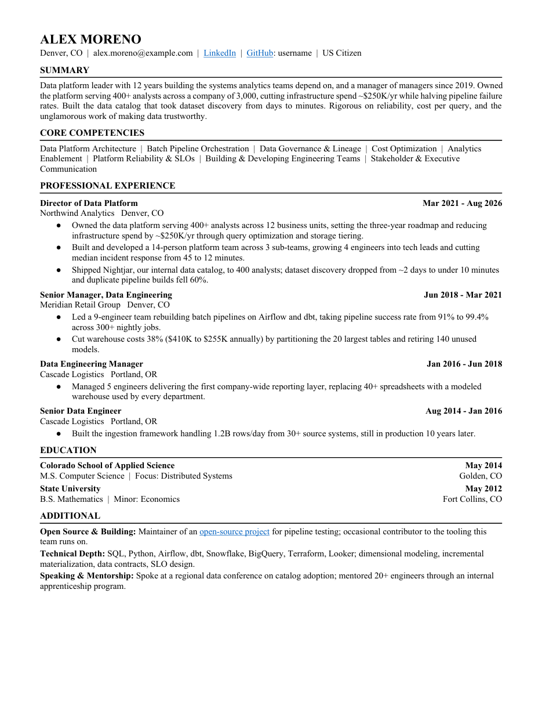

# CV Customizer

**A job-application engine that refuses to lie on your behalf.**

You give it a job posting. It tells you honestly whether the role is worth your time, and if it
is, generates a tailored CV, cover letter, and outreach plan — then mechanically audits them and
**refuses to deliver anything that fails**.

Runs inside [Claude Code](https://claude.com/claude-code). Python and LibreOffice underneath;
no accounts, no service, nothing leaves your machine.

---

## Try it in 60 seconds

```bash
git clone https://github.com/ellokojavi/cv-customizer && cd cv-customizer
pip install python-docx pymupdf
cp config/documents.example.json config/documents.json
cp -r profile.example profile

mkdir -p /tmp/demo
python3 engine/lib/build_cv.py -o /tmp/demo/20260824_Moreno_Alex_CV_v1.docx
soffice --headless --convert-to pdf --outdir /tmp/demo /tmp/demo/*.docx
python3 engine/lib/check_cv.py --cv /tmp/demo/20260824_Moreno_Alex_CV_v1.docx
```

That generates a real CV from the bundled example profile and audits it — no editing required to
see it work. The filename looks odd on purpose: names follow a configured pattern, and the
auditor checks that too.



---

## What the audit looks like

This is the actual output, not a mock-up:

```
  CV length       PASS  0.88 pages (cap 1.60), 1 sheet(s)
  CV dashes       PASS  no em-dashes or en-dashes
  CV font         PASS  Times New Roman
  Dates           PASS  6 lines right-aligned at 7.25in, format ok
  Chronology      PASS  4 roles, reverse-chronological
  Sections        PASS  SUMMARY > CORE COMPETENCIES > PROFESSIONAL EXPERIENCE > EDUCATION > ADDITIONAL
  Page breaks     PASS  no forced break before EDUCATION
  Bullets         PASS  all 7 bullets carry a number
  Hyperlinks      WARN  3 links, target 8-12; all canonical
  CV facts        PASS  7 guardrails clear
  Letter length   PASS  0.44 pages (cap 1.00), 1 sheet(s)
  Filenames       PASS  4 file(s) match pattern, all < 50 chars
  Folder hygiene  PASS  6 files, deliverables only
```

Page extent is **measured** from the rendered PDF, not estimated. Exit code 1 means fix
something.

## And this is the part that matters

Write down once the things you cannot defend in an interview — a title you never held, a figure
that drifted between CVs, a tool you never touched, work someone else owned. Then watch what
happens when a tailored CV quietly overclaims:

```
  CV facts   FAIL  VP/SVP self-label: highest real title is Director of Data Platform
                   (...PROFESSIONAL EXPERIENCE VP of Data Platform  Mar 2021 - A...);
                   stale platform cost-savings figure: the defensible number is ~$250K/yr
                   (...astructure spend by $500K/yr and building streaming pip...);
                   streaming tooling never used hands-on: batch pipelines and Airflow only
                   (...eaming pipelines on Kafka. Built and developed a 14-per...);
                   P&L ownership claim: the business unit owned P&L, not the platform team
                   (...Owned the P&L for the data platform serving...)

FAILED - nothing copied. Fix the FAILs and re-run.
A package that does not audit clean should not exist somewhere it can be sent by accident.
```

Four overclaims caught in one pass, and **nothing was written to the application folder.**

This exists because a model optimizing a CV against a job description is *structurally* inclined
to overclaim: the posting supplies the vocabulary, your history supplies something adjacent, and
the gap closes on its own. Prose rules do not stop it. In the archive this was built against,
banned claims shipped in real CVs **while the rule forbidding them sat in context.** So the
never-claim list is machine-checkable patterns, and the auditor hard-fails on them.

The corollary matters as much: **a guardrail firing on legitimate text is a bug in the pattern,
not the CV.** Add the sentence to your test fixtures, then loosen the rule. Never reword a
document to slip past a guardrail.

---

## What else it does

**Assesses before it builds.** Every posting gets a five-part verdict — what matches, what does
not, a seniority check, a clear go/no-go — before a document exists. It will tell you not to
apply. That is the feature; your time is the scarce resource, not the supply of postings.

**Generates rather than copies.** Copying last month's CV preserves formatting but *not* link
correctness: press links decay into homepages, canonical sources drift, half the set silently
vanishes. Generating from your profile removes that bug class instead of auditing for it.

**Tracks the pipeline.** A registry dedups every posting you have seen. A follow-up worklist
surfaces stale applications so they get an outreach attempt instead of rotting — because the
response rate, not the application count, is what actually binds.

## What it does not do

It does not apply for you, auto-send email, or scrape behind logins. It does not guarantee
interviews. **It does not invent achievements** — if a posting needs something you lack, it says
so and expects you to decide.

Cover-letter paragraphs and outreach research are your input: the engine guarantees the
packaging, not the judgement about a specific role.

It is **not general-purpose yet.** It encodes a senior individual running a targeted search in
the US market. Levels, domains, and geography live in config so adjacent fields work, but
early-career or non-US searches will need more than a config edit. Full list of limitations in
[CHANGELOG.md](CHANGELOG.md).

---

## Install properly

Requires **Claude Code**, **Python 3.8+**, and **LibreOffice** (`soffice`) for DOCX→PDF.

```bash
pip install python-docx pymupdf
```

`python-docx` is required to generate documents. `pymupdf` powers the page-measurement check and
the pre-publish scan; without it, length goes unmeasured and the auditor says so rather than
passing silently.

```bash
cp .claude/settings.example.json .claude/settings.json   # replace <PROJECT_ROOT> with your path
cp config/search.example.json    config/search.json
cp config/documents.example.json config/documents.json
cp -r profile.example            profile
python3 engine/lib/check_cv_tests.py                     # should pass
claude
```

Then run **`/setup`** inside Claude Code, or follow **[QUICKSTART.md](QUICKSTART.md)** by hand.
Either way the profile is what determines whether any of this is worth running, and it deserves
a real half hour.

## Commands

| Command | What it does |
|---|---|
| `/setup [cv.docx]` | Guided first run: extract your history, interview the gaps, end on a clean audit |
| `/jd <url>` | Assess a posting; if it is a strong fit, build the whole package |
| `/daily-search` | Run the full search sweep across every configured source |
| `/followups` | Post-application worklist: due actions, stale applies, outreach drafts |
| `/reaudit <company>` | Re-check a built-but-unsent package against current rules |
| `/hygiene` | Sweep for build junk, damaged files, and structural rot |
| `/refresh` | Periodic maintenance so profile, boards, and packages do not rot |

## A package is five files

`build_package.py` takes one `app.json` and produces, in a scratch directory:

```
20260824_Moreno_Alex_CV_v1.docx / .pdf
20260824_Moreno_Alex_CoverLetter_v1.docx / .pdf
20260824 outreach plan.md          contacts, email-pattern guesses, 3 ready-to-send drafts
Director of Data Platform - Acme Data.webloc
```

They are copied into the application folder **only if the audit passes.** Nothing is built beside
your deliverables, so no toolchain junk can end up in the folder.

## The tools underneath

Every command is ordinary Python you can run yourself.

```bash
python3 engine/lib/build_package.py --app app.json     # the whole set, gated on the audit
python3 engine/lib/check_cv.py "<folder>" [--jd jd.txt]
python3 engine/lib/check_cv_tests.py                   # guardrail regression suite

python3 engine/lib/build_cv.py -o cv.docx [--tailor t.json]
python3 engine/lib/build_cover_letter.py --letter l.json -o letter.docx
python3 engine/lib/build_outreach.py --plan p.json -o "outreach plan.md"
python3 engine/lib/extract_career.py <existing_cv.docx> -o profile/career.json

python3 engine/lib/registry.py check|add|applied|followups|expire|sync
python3 engine/lib/board_scan.py diff <slug> --ids "…" | status
python3 engine/lib/publish.py --to ../public-copy      # assemble + refuse on any leak
```

## How it is organised

**Five kinds of content, four homes.** Mixing them is what makes a system like this impossible to
share or upgrade.

| Layer | What it is | Ships? |
|---|---|---|
| `engine/` | **Method.** How to assess, build, audit, search. | Yes |
| `config/` | **Policy.** Page caps, fonts, comp floor, geography, cadence. Reads personal; is actually parameters. | As `*.example.json` |
| `profile/` | **Identity.** Your career facts, links, never-claim guardrails. | **Never** |
| `_registry/`, application folders | **State.** Your registry, scan state, every package built. | **Never** |

The test for anything in `engine/`: *if a sentence names a person, an employer, a city, a dollar
figure, or a machine path, it is misfiled.*

The payoff: `engine/` holds no user data, so upgrading means replacing `engine/` and keeping
everything else untouched.

```
engine/          00_principles · 10_fit_assessment · 20_cv_build · 22_outreach_plan
                 30_search · 50_ats_knowledge · 90_runtimes
engine/lib/      the tools above
engine/templates/ CV, cover letter, outreach plan + how to build a board library
profile.example/ a fictional candidate you copy and replace
```

## Privacy

`profile/`, your live `config/*.json`, and every application folder are git-ignored by default.
They hold your complete professional history and, once you start outreach, **other people's
contact details**. Before sharing anything, check what is actually in it — and note that
deleting files later does not remove them from git history.

If you fork this to build your own variant, `engine/lib/publish.py` assembles a shippable copy
and refuses on any identity term, reading inside `.docx` and `.pdf` because a text search sees
neither.

## License

MIT for engine code and templates — see [LICENSE](LICENSE). Your profile, your documents, and
your application history are yours and are not covered by this repository.

Version [1.0.0](CHANGELOG.md).
